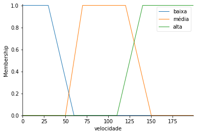
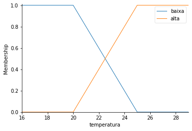
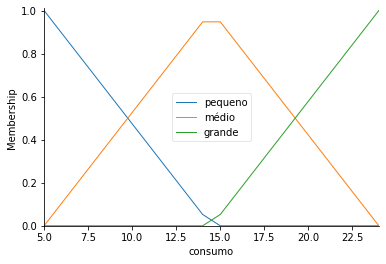

<h1 align="center">Logica Fuzzy</h1>
<p align="center">Resolução de problema de Consumo de combustível</p>
<p align="center">
  <a href="https://colab.research.google.com/github/dioumedeiros/fuzzy-logic/blob/master/fuzzy_logic.ipynb" target="_parent">
    
  </a>
</p>

## Instale o pacote skfuzzy

```python
!pip install networkx
!pip install scikit-fuzzy
```

## Criação de regras

```python
import numpy as np
import skfuzzy as fuzz
from skfuzzy import control as ctrl

# Cria as variáveis do problema - automóvel
velocidade = ctrl.Antecedent(np.arange(0, 200, 1), 'velocidade')
temperatura = ctrl.Antecedent(np.arange(16, 30, 1), 'temperatura')
consumo = ctrl.Consequent(np.arange(5, 25, 1), 'consumo')

# Cria automaticamente o mapeamento entre valores nítidos e difusos 
# usando uma função de pertinência padrão (triângulo)
consumo.automf(names=['pequeno', 'médio', 'grande'])


# Cria as funções de pertinência usando tipos variados
velocidade['baixa'] = fuzz.trapmf(velocidade.universe, [0, 0, 30, 60])
velocidade['média'] = fuzz.trapmf(velocidade.universe, [50, 70, 120, 150])
velocidade['alta'] = fuzz.trapmf(velocidade.universe, [110, 140, 200, 200])

temperatura['baixa'] = fuzz.trapmf(temperatura.universe, [16, 16, 20, 25])
temperatura['alta'] = fuzz.trapmf(temperatura.universe,[20, 25, 30, 50])

```

## Gerando gráficos

```python
velocidade.view()
temperatura.view()
consumo.view()
```






## Criação de regras difusas

```python
rule1 = ctrl.Rule(velocidade['baixa'] & temperatura['baixa'], consumo['pequeno'])
rule2 = ctrl.Rule(velocidade['baixa'] & temperatura['alta'], consumo['pequeno'])
rule3 = ctrl.Rule(velocidade['média'] & temperatura['baixa'], consumo['grande'])
rule4 = ctrl.Rule(velocidade['média'] & temperatura['alta'], consumo['médio'])
rule5 = ctrl.Rule(velocidade['alta'] & temperatura['baixa'], consumo['grande'])
rule6 = ctrl.Rule(velocidade['alta'] & temperatura['alta'], consumo['grande'])
```
